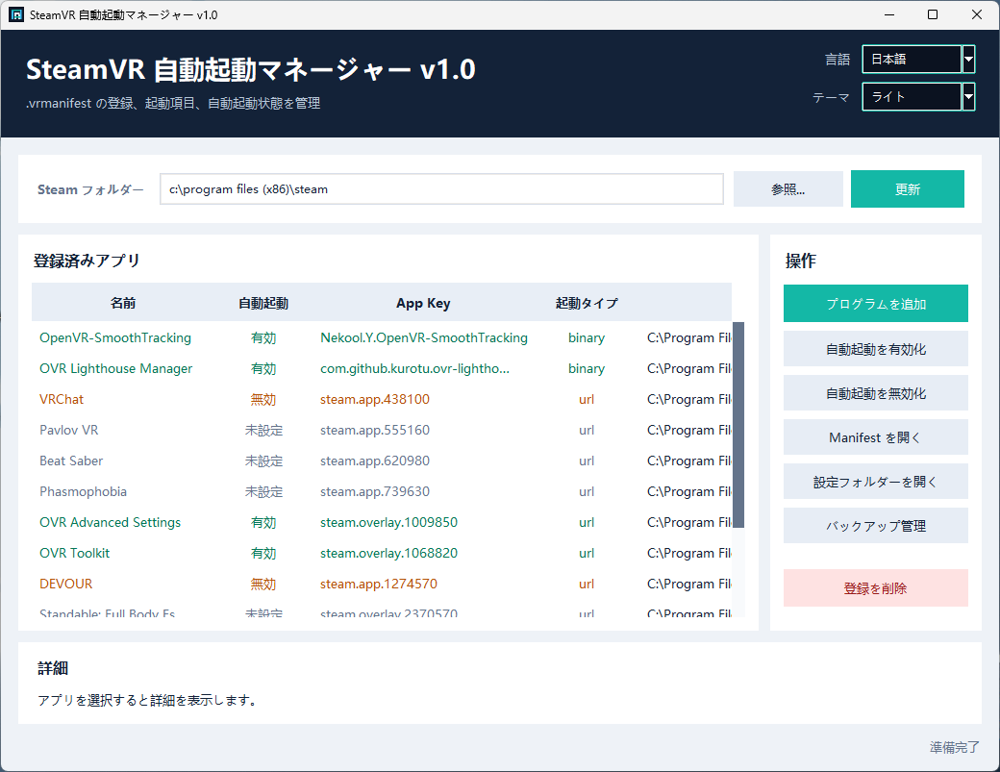

# SteamVR 自動起動マネージャー

[English](README.md) | [简体中文](README_zh.md) | [日本語] | [한국어](README_ko.md)

🏪 **Booth リンク:** [https://alanbacker.booth.pm/items/8416676](https://alanbacker.booth.pm/items/8416676)



SteamVR の `.vrmanifest` 登録と自動起動スイッチをより直感的に管理するための Windows デスクトップ GUI アプリケーションです。

## 機能

- Steam インストールディレクトリを自動認識し、手動で選択することも可能です。
- `Steam/config/appconfig.json` 内の `manifest_paths` を読み込みます。
- 各 `.vrmanifest` からアプリ名、`app_key`、起動プログラム、引数を解析します。
- `Steam/config/vrappconfig/<app_key>.vrappconfig` を介して自動起動を有効化または無効化します。
- 任意の Windows プログラムを追加し、独立した `.vrmanifest` を自動生成して SteamVR に登録します。
- 登録を削除する前に設定ファイルをバックアップします（対象プログラム自体は削除されません）。
- ツールによってデフォルトの `steamapps.vrmanifest` インデックスが削除されるのを防ぎ、SteamVR によるインストール済みゲームの認識に影響を与えないようにします。
- リスト項目を複数選択し、一括で自動起動を有効化、無効化、または登録削除できます。
- ライト、ダーク、システムに合わせたテーマモードをサポートします。
- インタラクティブなバックアップ管理：新規作成、更新、開く、削除、復元。
- 初回起動時、システム言語に基づいてインターフェース言語を自動選択します（言語リスト順：English、中文、日本語、한국어）。
- 言語、テーマモード、Steam ディレクトリ、ウィンドウサイズのユーザー設定を保持します。
- カスタムウィンドウアイコンを使用します。
- 新しい UI では常時読み込みのアニメーションが廃止され、ウィンドウのリサイズ時の動作が軽くなりました。
- 英語、中国語、日本語、韓国語のインターフェースを内蔵し、右上のコンボボックスからいつでも切り替え可能です。

## 実行方法

`steamvr_autostart_manager.pyw` をダブルクリックすることをお勧めします。Windows で `.pyw` ファイルが Python に関連付けられていない場合は、`run.bat` をダブルクリックするか、このディレクトリで次のコマンドを実行してください。

```powershell
py -3 steamvr_autostart_manager.py
```

Steam が `C:\Program Files` または `C:\Program Files (x86)` にインストールされていて、設定ファイルの書き込みに失敗する場合は、右クリックして「管理者として実行」してください。

## バックアップ

「バックアップ管理」をクリックすると、既存のバックアップの確認、新規作成、バックアップフォルダーを開く、削除、復元を実行できます。バックアップを作成すると、現在の `appconfig.json`、`steamapps.vrmanifest`、`vrappconfig` ディレクトリ、および登録済みの manifest ファイルが `%LOCALAPPDATA%\SteamVRManifestManager\manual_backups\...` にコピーされます。

バックアップを復元する前に、誤操作防止のためのロールバックポイントを確保するため、ツールが現在の設定を自動的にバックアップします。

## EXE へのパッケージング

PyInstaller がインストールされている場合、`build_exe.bat` をダブルクリックして `dist/SteamVR-Autostart-Manager.exe` にファイルを生成できます。作成者とバージョン情報は EXE のメタデータに書き込まれます（パブリッシャー：AlanBacker）。

PyInstaller がインストールされていない場合は、まず以下を実行してインストールしてください。

```powershell
py -3 -m pip install pyinstaller
```

## インストーラーのパッケージング

Inno Setup をインストールした後、`build_installer.bat` をダブルクリックして `installer_output/SteamVR-Autostart-Manager-Setup.exe` にインストーラーを生成します。

```powershell
winget install --id JRSoftware.InnoSetup -e
```

## SteamVR 設定の詳細

SteamVR/OpenVR は、マニフェストの追加、削除、および自動起動アプリの読み取り/設定を行う API インターフェースを提供しています。このツールは、OpenVR DLL を呼び出す代わりに、SteamVR の永続設定ファイルを直接編集します。

- `Steam/config/appconfig.json`：長期登録されているマニフェストのパスを保存します。
- `Steam/config/vrappconfig/<app_key>.vrappconfig`：個々のアプリケーションの `autolaunch` 状態を保存します。

プログラムを追加するとき、ツールは `%LOCALAPPDATA%\SteamVRManifestManager\manifests\...` の下に以下のようなマニフェストを生成します。

```json
{
   "source": "builtin",
   "applications": [
      {
         "app_key": "local.autostart.example.12345678",
         "launch_type": "binary",
         "binary_path_windows": "C:\\Path\\To\\Program.exe",
         "arguments": "",
         "is_dashboard_overlay": true,
         "strings": {
            "zh_cn": {
               "name": "Example",
               "description": "由 AlanBacker 制作的 SteamVR 自启动管理器注册。"
            },
            "en_us": {
               "name": "Example",
               "description": "Registered by AlanBacker's SteamVR Autostart Manager."
            },
            "ja_jp": {
               "name": "Example",
               "description": "AlanBacker 製 SteamVR 自動起動マネージャーによって登録されました。"
            },
            "ko_kr": {
               "name": "Example",
               "description": "AlanBacker가 만든 SteamVR 자동 시작 관리자가 등록했습니다."
            }
         }
      }
   ]
}
```

設定を変更する際は、SteamVR を閉じた状態で行い、その後に SteamVR を再起動して変更を適用することをお勧めします。

## 開発支援について

作者への支援や寄付をご検討いただける場合は、Boothの商品ページから「Support Me :3」オプションの購入をご検討いただけますと大変励みになります！
[https://alanbacker.booth.pm/items/8416676](https://alanbacker.booth.pm/items/8416676)

## ライセンス

このプロジェクトは MIT ライセンスの下でライセンスされています。詳細は [LICENSE](LICENSE) ファイルをご覧ください。
