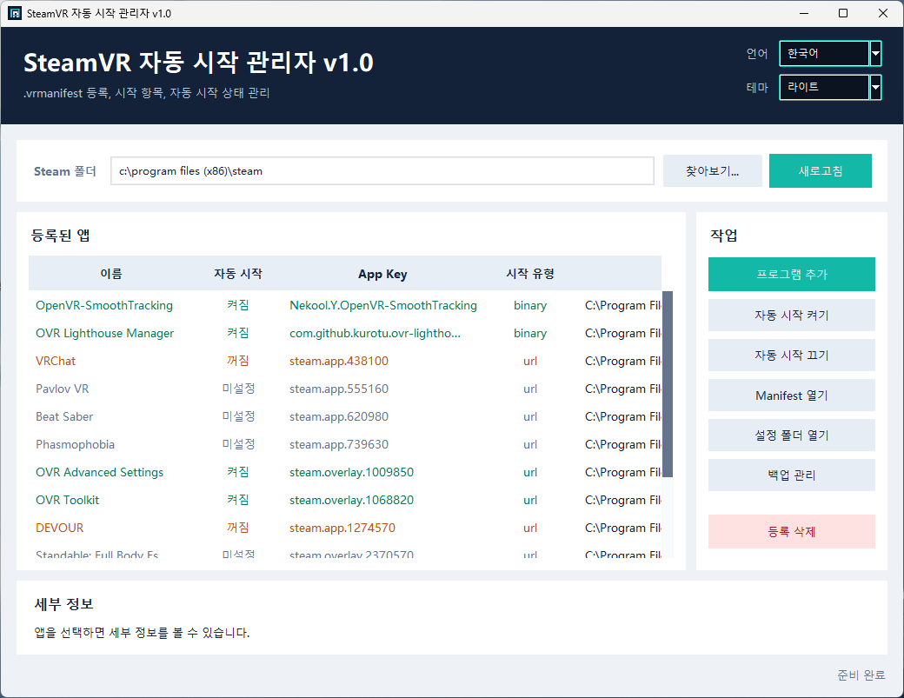

# SteamVR 자동 시작 관리자

[English](README.md) | [简体中文](README_zh.md) | [日本語](README_ja.md) | [한국어]

🏪 **Booth 링크:** [https://alanbacker.booth.pm/items/8416676](https://alanbacker.booth.pm/items/8416676)



SteamVR의 `.vrmanifest` 등록 및 자동 시작 스위치를 보다 직관적으로 관리할 수 있는 Windows 데스크톱 GUI 애플리케이션입니다.

## 기능

- Steam 설치 디렉터리를 자동으로 인식하며, 수동으로 선택할 수도 있습니다.
- `Steam/config/appconfig.json`에 있는 `manifest_paths`를 읽어옵니다.
- 각 `.vrmanifest`에서 앱 이름, `app_key`, 실행 프로그램 및 인수를 분석합니다.
- `Steam/config/vrappconfig/<app_key>.vrappconfig`를 통해 자동 시작을 켜거나 끕니다.
- 임의의 Windows 프로그램을 추가하여 독립적인 `.vrmanifest`를 자동 생성하고 SteamVR에 등록합니다.
- 등록을 삭제하기 전에 설정 파일을 백업하며, 대상 프로그램 자체는 삭제되지 않습니다.
- 툴에 의해 기본 `steamapps.vrmanifest` 인덱스가 삭제되는 것을 방지하여 SteamVR의 설치된 앱 인식에 영향을 주지 않도록 합니다.
- 목록에서 여러 항목을 다중 선택하여 일괄적으로 자동 시작을 켜거나, 끄거나, 등록을 삭제할 수 있습니다.
- 라이트, 다크, 시스템 설정에 맞춤 테마 모드를 지원합니다.
- 대화형 백업 관리: 백업 생성, 새로고침, 열기, 삭제, 복원.
- 첫 실행 시 시스템 언어에 따라 인터페이스 언어를 자동으로 선택합니다 (언어 목록 순서: English, 中文, 日本語, 한국어).
- 언어, 테마 모드, Steam 디렉터리, 창 크기 설정을 유지합니다.
- 사용자 지정 창 아이콘을 사용합니다.
- 새로운 UI에서는 상시 로딩 애니메이션이 제거되어 창 크기를 조절할 때 더욱 가볍게 작동합니다.
- 영어, 중국어, 일본어, 한국어 인터페이스가 기본 내장되어 있어 우측 상단 콤보박스에서 언제든지 전환할 수 있습니다.

## 실행 방법

`steamvr_autostart_manager.pyw`를 더블 클릭하는 것을 권장합니다. Windows에서 `.pyw` 파일이 Python과 연결되어 있지 않은 경우 `run.bat`를 더블 클릭하거나 이 디렉터리에서 다음 명령을 실행하십시오.

```powershell
py -3 steamvr_autostart_manager.py
```

Steam이 `C:\Program Files` 또는 `C:\Program Files (x86)`에 설치되어 있고 설정 파일 쓰기에 실패할 경우, 마우스 우클릭 후 '관리자 권한으로 실행'해 주십시오.

## 백업

"백업 관리"를 클릭하면 기존 백업을 확인하고 백업 생성, 백업 폴더 열기, 삭제, 복원을 수행할 수 있습니다. 백업을 생성하면 현재 `appconfig.json`, `steamapps.vrmanifest`, `vrappconfig` 디렉터리 및 등록된 manifest 파일이 `%LOCALAPPDATA%\SteamVRManifestManager\manual_backups\...`에 복사됩니다.

백업을 복원하기 전에 오작동을 방지하기 위해 툴이 현재 설정을 자동으로 먼저 백업하여 롤백 지점을 제공합니다.

## EXE로 패키징

PyInstaller가 설치된 경우 `build_exe.bat`를 더블 클릭하여 `dist/SteamVR-Autostart-Manager.exe`에 파일을 생성할 수 있습니다. 작성자 및 버전 정보는 EXE 메타데이터에 기록됩니다 (게시자: AlanBacker).

PyInstaller가 설치되어 있지 않은 경우 먼저 다음을 실행하여 설치하십시오.

```powershell
py -3 -m pip install pyinstaller
```

## 설치 프로그램 패키징

Inno Setup을 설치한 후, `build_installer.bat`를 더블 클릭하여 `installer_output/SteamVR-Autostart-Manager-Setup.exe`에 설치 프로그램을 생성합니다.

```powershell
winget install --id JRSoftware.InnoSetup -e
```

## SteamVR 설정 세부 사항

SteamVR/OpenVR은 매니페스트 추가, 매니페스트 제거, 자동 시작 앱 읽기/설정을 위한 API 인터페이스를 제공합니다. 이 툴은 OpenVR DLL을 호출하는 대신 SteamVR 영구 설정 파일을 직접 편집합니다.

- `Steam/config/appconfig.json`: 장기 등록된 매니페스트 경로를 저장합니다.
- `Steam/config/vrappconfig/<app_key>.vrappconfig`: 개별 애플리케이션의 `autolaunch` 상태를 저장합니다.

프로그램을 추가할 때, 이 툴은 `%LOCALAPPDATA%\SteamVRManifestManager\manifests\...` 경로 아래에 다음과 같은 매니페스트를 생성합니다.

```json
{
   "source": "builtin",
   "applications": [
      {
         "app_key": "local.autostart.example.12345678",
         "launch_type": "binary",
         "binary_path_windows": "C:\\Path\\To\\Program.exe",
         "arguments": "",
         "is_dashboard_overlay": true,
         "strings": {
            "zh_cn": {
               "name": "Example",
               "description": "由 AlanBacker 制作的 SteamVR 自启动管理器注册。"
            },
            "en_us": {
               "name": "Example",
               "description": "Registered by AlanBacker's SteamVR Autostart Manager."
            },
            "ja_jp": {
               "name": "Example",
               "description": "AlanBacker 製 SteamVR 自動起動マネージャーによって登録されました。"
            },
            "ko_kr": {
               "name": "Example",
               "description": "AlanBacker가 만든 SteamVR 자동 시작 관리자가 등록했습니다."
            }
         }
      }
   ]
}
```

설정을 수정할 때는 SteamVR을 종료한 상태에서 수행하는 것을 권장하며, 그 후 SteamVR을 다시 시작하여 효과를 확인해 주십시오.

## 후원 안내

개발자를 후원하고자 하신다면 Booth 상품 페이지에서 'Support Me :3' 옵션을 선택하여 구매해 주세요. 감사합니다!
[https://alanbacker.booth.pm/items/8416676](https://alanbacker.booth.pm/items/8416676)

## 라이선스

이 프로젝트는 MIT 라이선스에 따라 라이선스가 부여됩니다. 자세한 내용은 [LICENSE](LICENSE) 파일을 참조하십시오.
